# FitLife Gym Website

  <!-- Replace with actual logo image -->

## Project Overview
**FitLife Gym** is a modern, responsive, and fully functional fitness website built for a fictional gym brand.  
The website is designed to provide a clean user experience with sections like Homepage, About Us, Classes, Contact, and Map integration.

Live Demo: [https://hanif-final-pitp-project.vercel.app/](https://hanif-final-pitp-project.vercel.app/)

---

## Features

- Fully responsive design (mobile, tablet, desktop)
- Modern UI with animations (AOS - Animate On Scroll)
- Contact form integrated with Formspree for email submissions
- Interactive Google Map to locate the gym
- Membership goals selection and inquiry form
- WhatsApp and Email direct contact buttons
- Smooth scrolling and hover effects for better UX
- Footer and header components loaded dynamically

---

## Screenshots

### Homepage
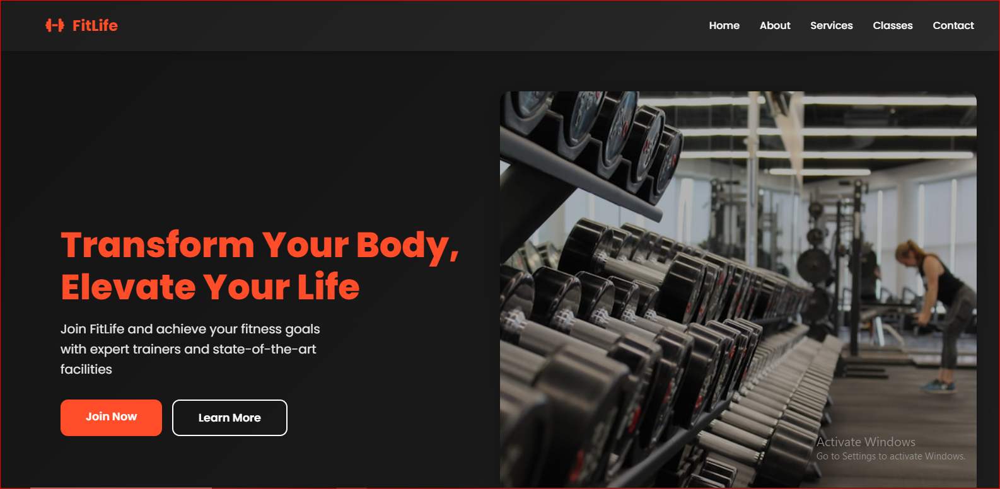
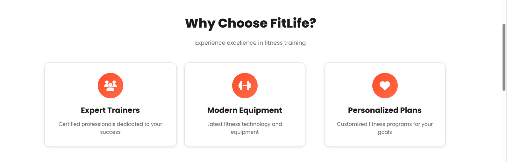
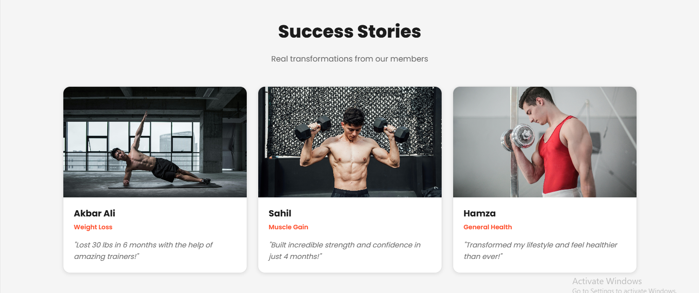  <!-- Add actual screenshot -->

### About Page
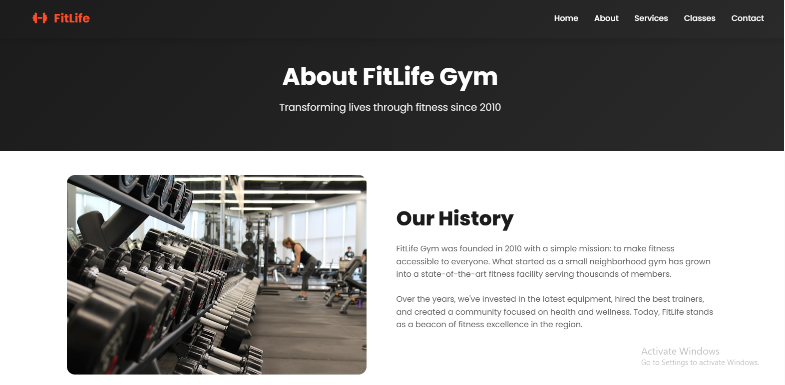
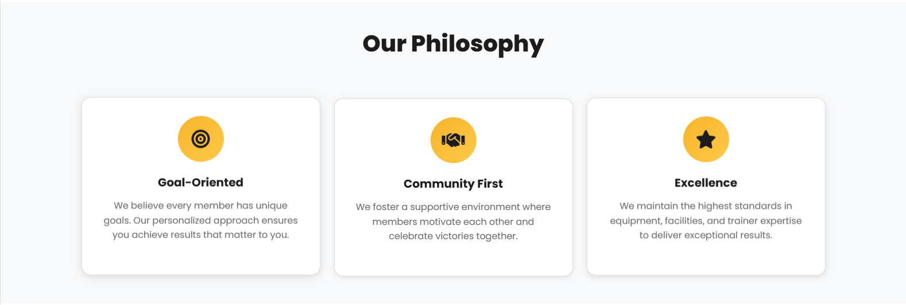
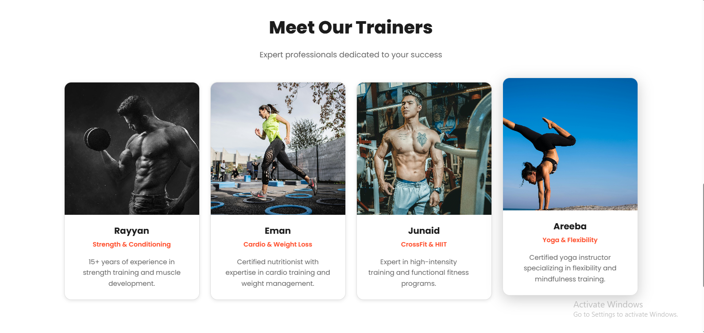
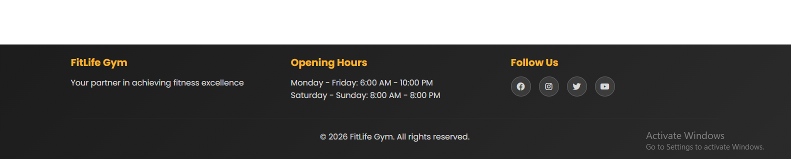


### Service Page
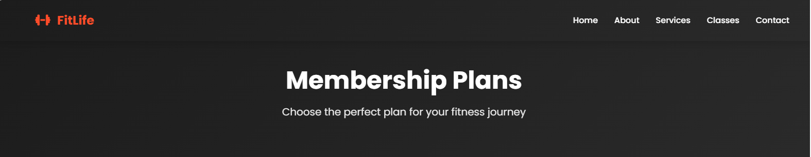
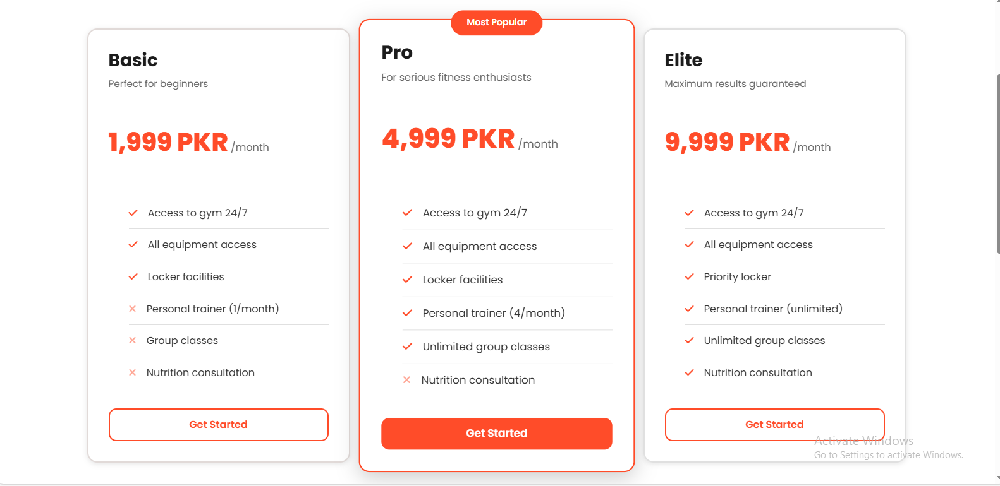

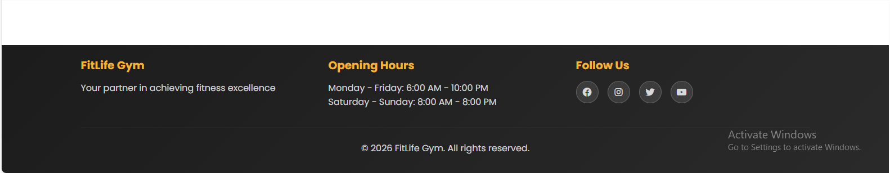


### Classes Page
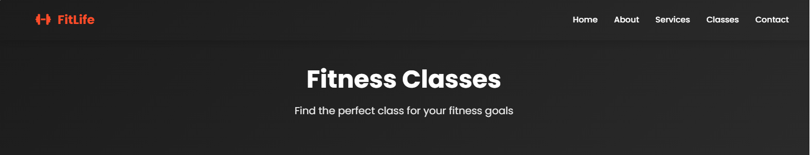
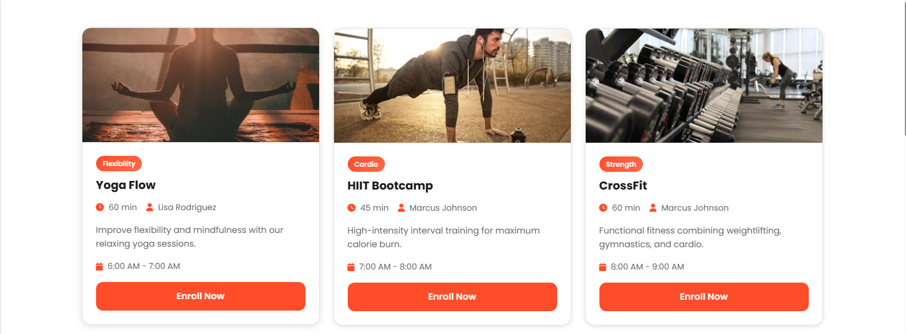
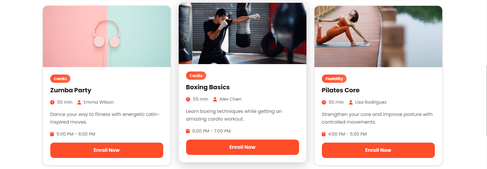
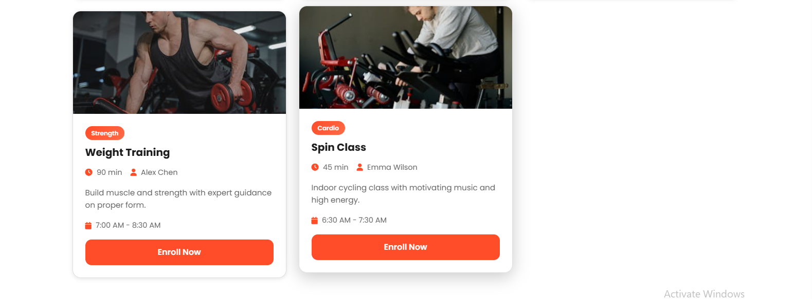
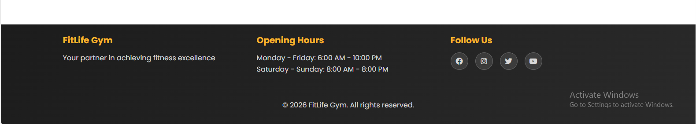


### Contact Page
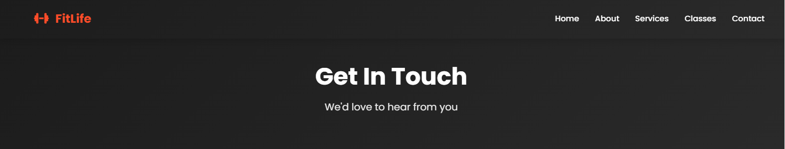
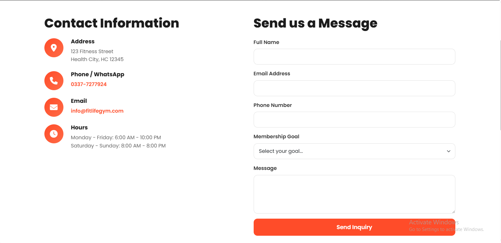
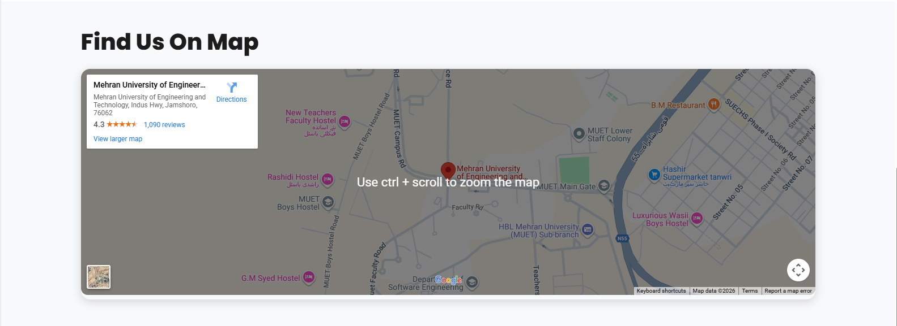
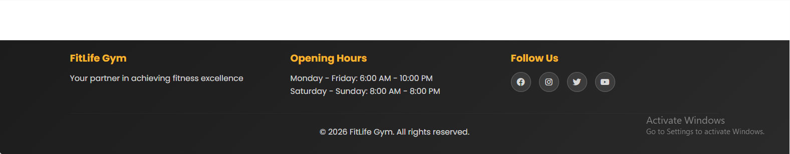

---

## Technology Stack

- **Frontend:** HTML5, CSS3, JavaScript
- **Frameworks / Libraries:** Bootstrap 5, Font Awesome, AOS
- **Forms:** Formspree for backend-less contact form submission
- **Deployment:** Vercel

---

## Installation / Setup

1. Clone the repository:

```bash
git clone https://github.com/your-username/fitlife-gym.git
